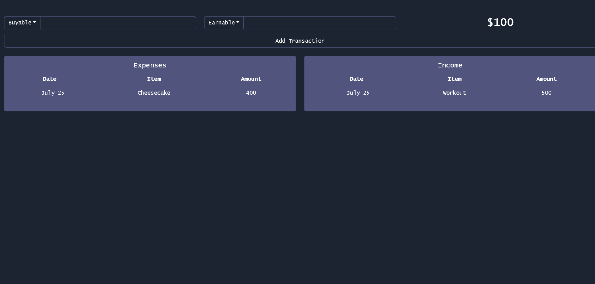

# Rewards System
This project is a system where you are able to earn "money" by completing various tasks, and use that money. This system tracks the income and expenses.  
## Usage
1. Open `data/ITEMS` and fill the earnable and buyable items. Do not modify formatting, follow example within the file.
2. Execute dockerfile; bind internal port 80
3. Navigate to `http://<your-ip-address>/` to view the user interface

